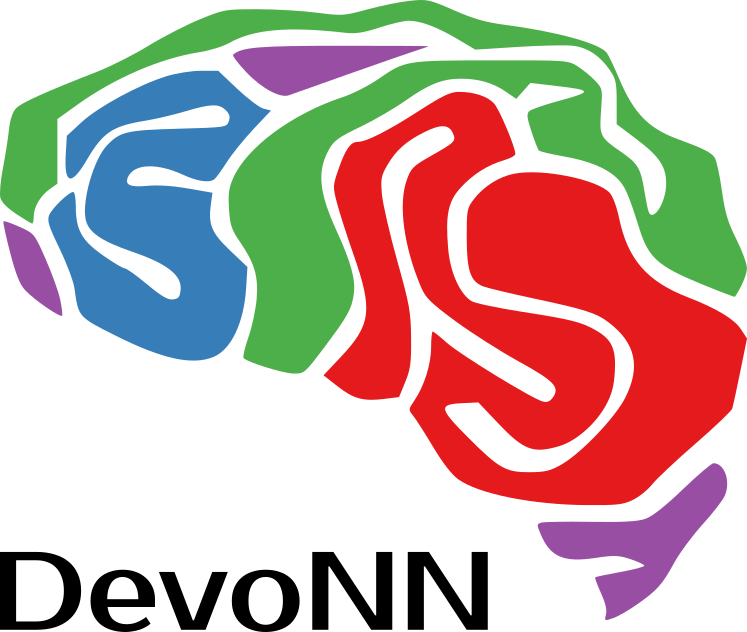

# Overview

In nature, brains are built through a process of biological development in which
many aspects of the network of neurons and connections change are shaped by
external information received through sensory organs. Biological development
mechanisms such as axon guidance and dendrite pruning have been shown to rely on
neural activity. Despite this, most artificial neural network (ANN) models do
not include developmental mechanisms and regard learning as the adjustment of
connection weights, while some that do use development restrain it to a period
before the ANN is used. It is worthwhile to understand the cognitive functions
offered by development and to investigate the fundamental questions raised by
artificial neural development. In this workshop, we will explore existing and
future approaches that aim to incorporate development into ANNs. Invited
speakers will present their work with neural networks, both artificial and
biological, in the context of development. Accepted submissions on contemporary
work in this field will be presented and we will hold an open discussion on the
topic.

# [2020 Workshop](/devonn/2020/07/13/alife.html)

The 3rd edition of the Developmental Neural Networks Workshop will be held as a
part of [ALIFE 2020](https://2020.alife.org/) in its virtual format. To
participate and for more information, please see the [2020 workshop
page](/devonn/2020/07/13/alife.html).

## Program

10:00-11:30 EDT | Live viewing of presentations |
11:30-11:45 EDT | Q&A for Keynote presentation [**Neuromorphic computers, brains and development: unifying principles and distinctive differences**](/devonn/2020/07/13/laughlin.html) | Simon Laughlin | [pdf](/devonn/files/2020/laughlin_final.pdf) | [video](/devonn/2020/07/13/laughlin.html)
11:45-11:55 EDT | Q&A for [**Developmental neuronal networks as models to study the evolution of biological intelligence**](/devonn/2020/07/13/hintze.html) | Arend Hintze, P. Robin Hiesinger, Jory Schossau  | [pdf](/devonn/files/2020/hintze_final.pdf) | [video](/devonn/2020/07/13/hintze.html)
11:55-12:05 EDT | Q&A for [**Multiple problem solving with evolved developmental neural networks: activity dependence**](/devonn/2020/07/13/miller.html) | Julian Francis Miller | [pdf](/devonn/files/2020/miller_final.pdf) | [video](/devonn/2020/07/13/miller.html)
12:05-12:15 EDT | Q&A for [**Developmental Embodied Agents as Meta-brain Models**](/devonn/2020/07/13/alicea.html) | Bradly Alicea et al. | [pdf](/devonn/files/2020/alicea_final.pdf) | [video](/devonn/2020/07/13/alicea.html)
12:15-13:00 EDT | Panel discussion on developmental neural networks |

## Submissions

We welcome anyone to participate and encourage the submission of extended
abstracts of 2-4 pages (MIT Press format). We are open to submissions
concerning a variety of neural development topics, from hand-written rules to
evolved systems, and from conceptual work to experimental results. Accepted
submissions will be distributed online and presented during the workshop.
Abstracts must be submitted via email to
[devonn@irit.fr](mailto:devonn@irit.fr) by June 15th, 2020 UTC-12. This
deadline will not be extended.

## Important Dates

+ Abstract Submission: June 15, 2020
+ Author Notification: July 1, 2020
+ Workshop: July 18, 2020 
+ ALIFE: July 13-18, 2020

# Organizers

+ Julian F Miller, [julian.miller@york.ac.uk](mailto:&#106;&#117;&#108;&#105;&#097;&#110;&#046;&#109;&#105;&#108;&#108;&#101;&#114;&#064;&#121;&#111;&#114;&#107;&#046;&#097;&#099;&#046;&#117;&#107;)
+ Sylvain Cussat-Blanc, [sylvain.cussat-blanc@irit.fr](mailto:&#115;&#121;&#108;&#118;&#097;&#105;&#110;&#046;&#099;&#117;&#115;&#115;&#097;&#116;&#045;&#098;&#108;&#097;&#110;&#099;&#064;&#105;&#114;&#105;&#116;&#046;&#102;&#114;)
+ Dennis G Wilson, [dennis.wilson@isae-supaero.fr](mailto:&#100;&#101;&#110;&#110;&#105;&#115;&#46;&#119;&#105;&#108;&#115;&#111;&#110;&#64;&#105;&#115;&#97;&#101;&#45;&#115;&#117;&#112;&#97;&#101;&#114;&#111;&#46;&#102;&#114;)

The organizers can be contacted at [devonn@irit.fr](mailto:&#100;&#101;&#118;&#111;&#110;&#110;&#64;&#105;&#114;&#105;&#116;&#46;&#102;&#114;).
